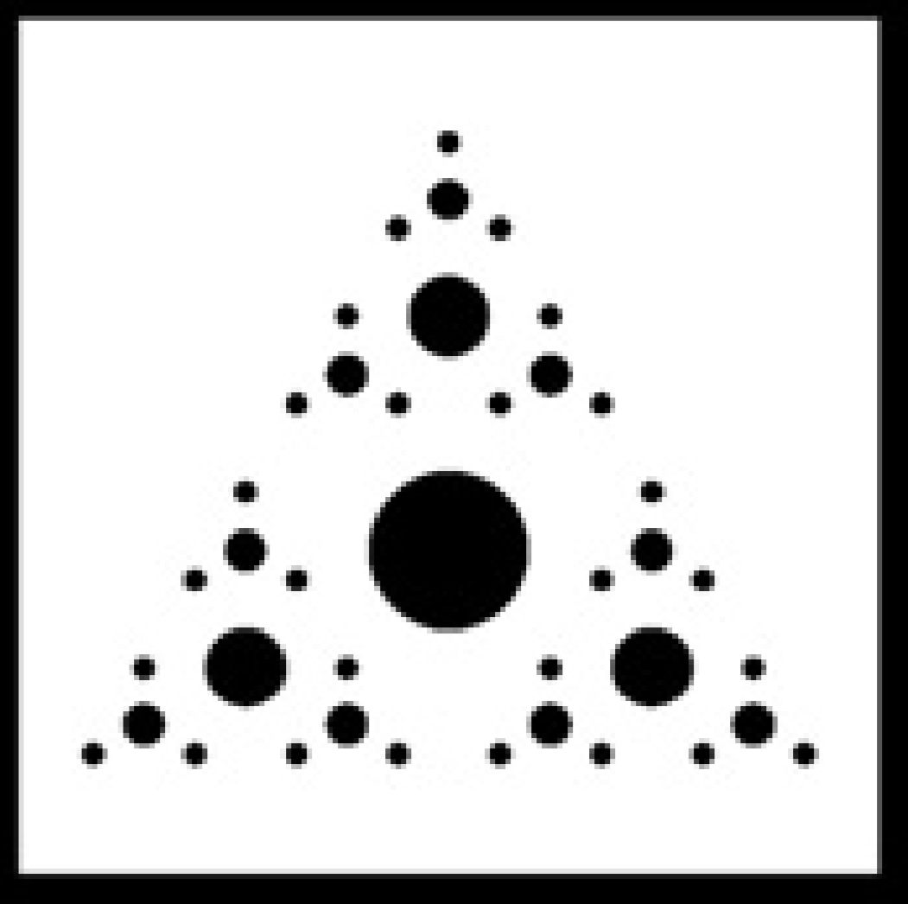
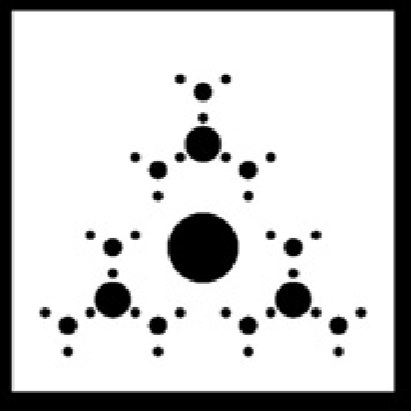

```{r setup, include=FALSE}
knitr::opts_chunk$set(echo = TRUE, warning=FALSE, message = FALSE, error = FALSE)
```

```{r load_packages, echo=FALSE}
library(tidyverse)
library(ggpubr)
library(rstatix)
library(psych)
library(haven)
library(jtools)
library(ggstatsplot)
library(AICcmodavg)
library(emmeans)
library(lsr)
library(tidybayes)
library(brms)
library(cowplot)
library(dplyr)

set.seed(617)
seed <- set.seed(617)
```
## 1 Experiment

### 1.1 Participants
A total of 97 participants took part in this experiment.

### 1.2 Materials and Design
During the experiment the participants were presented with three different tasks:

* an oddball task
* a recursion task (VRT)
* an iteration task (EIT)

In the oddball key-press task, the participants were presented with either a "fractal" image amongst "non-fractal" images or the other way around.
They then had to press a key on their keyboard (`G` or `H`) respective to if the perceived image is a fractal or non-fractal image.
This task was counterbalanced. The image-stimuli here were put into groups according to their complexity ("depth"" of image-structure).

In the VRT and EIT task, participants were presented with three images, one visible at a time, of one of to types of iteration (hierarchical and within level iteration) and then had to choose the correct next iteration-step amongst two images, both visible at the same time. In order to perform this, participants had to click one of the two buttons, one below each image.

The used images were created in python with 4 symbols (circle, square, arrow, triangle), ordered into 4 different geometrical shapes (Triangle, Square, Pentagon, Hexagon) and generated in 5 different "levels" from 1 - 5.


### 1.3 Procedure
Each participant first had three questions, regarding their knowledge on fractals and their dominant hand.
Afterwards they were presented with a short introduction-page into what is defined as a fractal and what not.
Each participant was presented with 6 EIT and 6 VRT tasks. The participants were presented with the key-press task twice (once for fractals in non-fractals, once the opposite).
For each key-press task occurrence the participants were presented with 1-8 images of the common stimulus-type and then 1 oddball-stimulus. This was repeated 15 times.


## 2 Hypothesis
We are interested in the following hypothesis:

### 2.1 General Hypothesis:
Our general hypothesis was that Fractals are easier to correctly process than non-fractals.
This is due to the results by Martins et. all. from 2014, where they showed that fractal structures have different activation patterns than non-fractals.
Furhtermore, we expected fractals to be processed slower than non-fractal images. In previous research there was no clear evidence if the RTs would be faster or slower for fractal images, but based on our descriptive data we chose the hypothesis directed this way.

### 2.2 Hypothesis 1: Correctness
If there is a correlation between a fractal or a non-fractal and the correctness, we expect that the correctness of the fractal stimuli should be higher than the correctness for non-fractal stimuli for the different task types:

#### 2.2.1 Hypothesis 1.1 - Iteration

If there is a correlation between a fractal iteration or a non-fractal iteration on the correctness in the EIT task, we expect that the correctness of the fractal stimuli should be higher than the correctness for non-fractal stimuli.

> Correctness<sub>EIT-fractal</sub>  >  Correctness<sub>EIT-non-fractal</sub>

#### 2.2.2 Hypothesis 1.2 - Hierarchical Iteration

If there is a correlation between the hierarchical iteration (HI) approach on iteration vs. the non-hierarchical iteration (I) of fractal stimuli on correctness, we expect that the correctness of the hierarchical iteration should be higher than for the non-hierarchical iteration.

> Correctness<sub>HI-fractal</sub>  >  Correctness<sub>I-fractal</sub>

#### 2.2.3 Hypothesis 1.3 - Oddball

If there is a correlation between fractal vs non-fractal stimuli on correctness in a non iterative task (the oddball key-press task here (oddball task)), we expect that the correctness of the fractal stimuli should be higher that for the non-fractal stimuli.


> Correctness<sub>oddball task-fractal</sub>  >  Correctness<sub>oddball task-non-fractal</sub>


### 2.3 Hypothesis 2: Response times
If there is a correlation between fractal images vs non-fractal images and the response time, we expect to see a significant different between those two conditions for the different task types:

#### 2.3.1 Hypothesis 2.1 - Iteration

If there is a correlation between a fractal iteration or a non-fractal iteration on the response time in the EIT task, we expect that the response time of the fractal stimuli should be faster than the correctness for non-fractal stimuli.

> RT<sub>EIT-fractal</sub>  <  RT<sub>EIT-non-fractal</sub>

#### 2.3.2 Hypothesis 2.2 - Hierarchical Iteration

If there is a correlation between the hierarchical iteration (HI) approach on iteration vs. the non-hierarchical iteration (I) of fractal stimuli on the response time, we expect that the response time of the hierarchical iteration should be faster than for the non-hierarchical iteration.

> RT<sub>HI-fractal</sub>  <  RT<sub>I-fractal</sub>

#### 2.3.3 Hypothesis 2.3 - Oddball

If there is a correlation between fractal vs non-fractal stimuli on the response time in a non iterative task (the oddball key-press task here (oddball task)), we expect that the response time of the fractal stimuli should be faster that for the non-fractal stimuli.


> RT<sub>oddball task-fractal</sub>  <  RT<sub>oddball task-non-fractal</sub>


For the response time - hypotheses we chose the direction as: *RT<sub>fractal</sub> has a faster RT than RT<sub>fractal</sub>*, since the previous studies didn't give a clear direction regarding the response time and the observed descriptive data in the first experiment test showed a direction towards this.
This decision was done in order to get clearer results in the analysis. 


#### Hypothesis 1.4 and 2.4 - Attention

Moreover, we wanted to look at the effect of the **task type**, which image type, fractal or non-fractal, is the oddball-stimulus category, on both the correctness and the RT in the Oddball task to look at the effect on attention.

If there is a positive effect of fractal images on attention, we expect the fractal oddball images in the non-fractal standard condition to have a strong effect on the correctness and because of that result in higher correctness in comparison to the opposite condition, in which non-fractal oddball images amongst primary fractal standard images.
For the correctness, we expect fractals to have a positive effect on correctness:

> H<sub>1.4</sub>: Correctness<sub>Fractal, Oddball: fractal</sub> > Correctness<sub>non-fractal, Oddball: non-fractal</sub>

Regarding the effect of fractals on RTs, we expect fractals to result in faster RTs when appearing as oddballs:

> H<sub>2.4</sub>: RT<sub>Fractal, Oddball: fractal</sub> < RT<sub>non-fractal, Oddball: non-fractal</sub>


## 3 Results

### 3.1 Loading the data
Here we load the data of the csv-file.
```{r load_data, echo=FALSE}
library(pillar)
exp_data <- read.csv("results_fractal_perception.csv")
```

```{r data_table_modification, echo=FALSE}
# look at different different hands, exclude left-handed people if small amount
exp_data_hands <- subset(exp_data, question == "Which hand is your primary hand?")
exp_data_right <- subset(exp_data_hands, response == "right")
exp_data_left <- subset(exp_data_hands, response == "left")

length(exp_data_left$submission_id)

# exclude left handed participants, only 5 people => too little number to observe effects
exp_data <- subset(exp_data, question == "Which hand is your primary hand?" && response == "right")

# add shapes and complexity to data
exp_data %>%
  mutate(shape = case_when(grepl("images/Generated_Pictures/Tri.*", exp_data$picture) == TRUE | grepl("Tri_", picture1) == TRUE ~ "Tri",
                           grepl("images/Generated_Pictures/Quad.*", exp_data$picture) == TRUE | grepl("Quad_", picture1) == TRUE ~ "Quad",
                           grepl("images/Generated_Pictures/Penta.*", exp_data$picture) == TRUE | grepl("Penta_", picture1) == TRUE ~ "Penta",
                           grepl("images/Generated_Pictures/Hexa.*", exp_data$picture) == TRUE | grepl("Hexa_", picture1) == TRUE ~ "Hexa"),
         complexity = case_when(trial_name == "key_press_first_one_comp_2" | trial_name == "key_press_first_two_comp_2" | trial_name == "key_press_second_one_comp_2" | trial_name == "key_press_second_two_comp_2" ~ 2,
                                trial_name == "key_press_first_one_comp_3" | trial_name == "key_press_first_two_comp_3" | trial_name == "key_press_second_one_comp_3" | trial_name == "key_press_second_two_comp_3" ~ 3,
                                trial_name == "key_press_first_one_comp_4" | trial_name == "key_press_first_two_comp_4" | trial_name == "key_press_second_one_comp_4" | trial_name == "key_press_second_two_comp_4" ~ 4,
                                grepl("(Hexa|Penta|Quad|Tri)_(circle|arrow|triangle|square_3_.*)", exp_data$picture1) == TRUE ~ 3,
                                grepl("(Hexa|Penta|Quad|Tri)_(circle|arrow|triangle|square_4_.*)", exp_data$picture1) == TRUE ~ 4),
         key_press_type = case_when(grepl(".*_first.*", exp_data$trial_name) == TRUE ~ "nF in F",
                                    grepl(".*_second.*", exp_data$trial_name) == TRUE ~ "F in nF")) -> exp_data

exp_data %>%
  mutate(shapeCode = case_when(shape == "Tri" ~ 3,
                               shape == "Quad"~ 4,
                               shape == "Penta" ~ 5,
                               shape == "Hexa" ~ 6),
         correct = case_when(correctness == "correct"~TRUE,
                             correctness == "incorrect" ~FALSE),
         nFOddball = case_when(key_press_type == "nF in F" ~ TRUE,
                                        key_press_type == "F in nF" ~ FALSE),
         fractal = case_when(expected == "fractal" ~ TRUE,
                                  expected == "non-fractal" ~ FALSE)) -> exp_data


exp_data %>% 
  mutate(fracNfrac = case_when(expected == "right" & grepl("false", picture2) ~ "non-fractal",
                               expected == "right" & grepl("false", picture1) ~ "fractal",
                               expected == "left" & grepl("false", picture1) ~ "non-fractal",
                               expected == "left" & grepl("false", picture2) ~ "fractal")) -> exp_data

exp_data %>%
  mutate(fractal = case_when(fracNfrac == "fractal" ~ TRUE,
                                     fracNfrac == "non-fractal" ~ FALSE),
         fractalTrial = case_when(trial_name == "fractal_view_2D" ~ FALSE,
                                   trial_name == "fractal_view_2D_fractal" ~TRUE)) -> exp_data


glimpse(exp_data)
```
The most important variables in this data-set are:

* `submission_id`: Shows an individual id per Participant
* `RT`: Shows the response time in each trial
* `correctness`: Shows whether the given answer was correct or not (**correct**, **incorrect**)
* `complexity`: Shows the depth of the complexity of the stimulus-picture (**2**,**3**, **4**)
* `shape`: Shows the overall shape of the stimulus-picture (**Tri**, **Quad**, **Penta**, **Hexa**)
* `trial_name`: Shows the name of the task type the data-point comes from (fractal_view_2D, fractal_view_2D_fractal, key-press.*)
* `key_press_type`: Indicates the oddball-condition of the key-press task (oddball: **fractal**, oddball: **non-fractal**)
* `fracNFrac`: indicates for EIT and VRT whether the stimulus is fractal or not fractal (**fractal**, **non-fractal**)
* `expected`: indicates for oddball task whether the stimulus is fractal or not fractal (**fractal**, **non-fractal**)

### 3.2 Cleaning the data
We looked a the outlier behavior regarding RT in every task type using the Interquartile Range Criterion:
```{r clean_data, echo=FALSE}
# time-spent outlier detection:
Q_ts <- quantile(exp_data$timeSpent, probs=c(.25, .75), na.rm = FALSE)
iqr_ts <- IQR(exp_data$timeSpent)
up_ts <-  Q_ts[2]+1.5*iqr_ts # Upper Range 
low_ts<- Q_ts[1]-1.5*iqr_ts # Lower Range
# remove outliers:
exp_data <- subset(exp_data, exp_data$timeSpent > (Q_ts[1] - 1.5*iqr_ts) & exp_data$timeSpent < (Q_ts[2] + 1.5*iqr_ts))

# Key-press data
key_press_with_out <- subset(exp_data, question == "Is this a fractal?")
# VRT data
continuation_with_out_HI <- subset(exp_data, trial_name == "fractal_view_2D_fractal")
# EIT data
continuation_with_out_I <- subset(exp_data, trial_name == "fractal_view_2D")


key_press_with_out %>%
  mutate(fractal  = case_when(expected == "fractal" ~ TRUE,
                              expected == "non-fractal" ~ FALSE)) -> key_press_with_out
```

```{r, results='hide'}
############################################################################################
##                              OUTLIER DELETION:                                         ##
############################################################################################

df_kp_corr_perPart <- key_press_with_out %>% 
  group_by(submission_id) %>%
  summarise(across(correct, mean, na.rm = TRUE))
boxplot(df_kp_corr_perPart$correct)

df_VRT_corr_perPart <- continuation_with_out_HI %>% 
  group_by(submission_id) %>%
  summarise(across(correct, mean, na.rm = TRUE))
boxplot(df_VRT_corr_perPart$correct)

df_EIT_corr_perPart <- continuation_with_out_I %>% 
  group_by(submission_id) %>%
  summarise(across(correct, mean, na.rm = TRUE))
boxplot(df_EIT_corr_perPart$correct)

### remove outliers from data
kp_corr_out <- boxplot(df_kp_corr_perPart$correct, plot=FALSE)$out
VRT_corr_out <- boxplot(df_VRT_corr_perPart$correct, plot=FALSE)$out
EIT_corr_out <- boxplot(df_EIT_corr_perPart$correct, plot=FALSE)$out

kp_pP_corr_nO<-df_kp_corr_perPart
kp_pP_corr_nO<- kp_pP_corr_nO[-which(kp_pP_corr_nO$correct %in% kp_corr_out),]

VRT_pP_corr_nO<-df_VRT_corr_perPart
VRT_pP_corr_nO<- VRT_pP_corr_nO[-which(VRT_pP_corr_nO$correct %in% VRT_corr_out),]

EIT_pP_corr_nO<-df_EIT_corr_perPart
EIT_pP_corr_nO<- EIT_pP_corr_nO[-which(EIT_pP_corr_nO$correct %in% EIT_corr_out),]

library(daff) # load daff library

render_diff(diff_data(df_kp_corr_perPart, kp_pP_corr_nO,id=c("Name","col1"))) # 193, 206, 220, 225
kp_corr_out_l <- list(193, 206, 220, 225)
render_diff(diff_data(df_VRT_corr_perPart, VRT_pP_corr_nO,id=c("Name","col1"))) # 108, 124, 137, 204
VRT_corr_out_l <- list(108, 124, 137, 204)
render_diff(diff_data(df_EIT_corr_perPart, EIT_pP_corr_nO,id=c("Name","col1"))) # 104, 114, 120, 135, 140, 196, 198, 202
EIT_corr_out_l <- list(104, 114, 120, 135, 140, 196, 198, 202)

key_press_with_out %>%
  filter(!submission_id %in% kp_corr_out_l) -> key_press_with_out

continuation_with_out_HI %>%
  filter(!submission_id %in% VRT_corr_out_l) -> continuation_with_out_HI

continuation_with_out_I %>%
  filter(!submission_id %in% EIT_corr_out_l) -> continuation_with_out_I


```

```{r}

###########################################################################################
##                              RT related outiers                                       ##
###########################################################################################
# Outlier detection Key-press task:
Q_KP <- quantile(key_press_with_out$RT, probs=c(.25, .75), na.rm = FALSE)
iqr_KP <- IQR(key_press_with_out$RT)
# how to find outliers in r - upper and lower range:
up_KP <-  Q_KP[2]+1.5*iqr_KP # Upper Range  
low_KP<- Q_KP[1]-1.5*iqr_KP # Lower Range
# how to remove outliers in r (the removal)
key_press <- subset(key_press_with_out, key_press_with_out$RT > (Q_KP[1] - 1.5*iqr_KP) & key_press_with_out$RT < (Q_KP[2]+1.5*iqr_KP))

# Continuation - Hierarchical Iteration (VRT)
Q_Cont_HI <- quantile(continuation_with_out_HI$RT, probs=c(.25, .75), na.rm = FALSE)
iqr_Cont_HI <- IQR(continuation_with_out_HI$RT)
# how to find outliers in r - upper and lower range
up_Cont_HI <-  Q_Cont_HI[2]+1.5*iqr_Cont_HI # Upper Range  
low_Cont_HI<- Q_Cont_HI[1]-1.5*iqr_Cont_HI # Lower Range
# how to remove outliers in r (the removal)
Continuation_HI <- subset(continuation_with_out_HI, continuation_with_out_HI$RT > (Q_Cont_HI[1] - 1.5*iqr_Cont_HI) & continuation_with_out_HI$RT < (Q_Cont_HI[2]+1.5*iqr_Cont_HI))

# Continuation - Iiteration (EIT)
Q_Cont_I <- quantile(continuation_with_out_I$RT, probs=c(.25, .75), na.rm = FALSE)
iqr_Cont_I <- IQR(continuation_with_out_I$RT)
# how to find outliers in r - upper and lower range
up_Cont_I <-  Q_Cont_I[2]+1.5*iqr_Cont_I # Upper Range  
low_Cont_I<- Q_Cont_I[1]-1.5*iqr_Cont_I # Lower Range
# how to remove outliers in r (the removal)
Continuation_I <- subset(continuation_with_out_I, continuation_with_out_I$RT > (Q_Cont_I[1] - 1.5*iqr_Cont_I) & continuation_with_out_I$RT < (Q_Cont_I[2]+1.5*iqr_Cont_I))


## Number of Outliers
len_out_EIT <- length(continuation_with_out_I$RT) - length(Continuation_I$RT)
len_out_VRT <- length(continuation_with_out_HI$RT) - length(Continuation_HI$RT)
len_out_KP <- length(key_press_with_out$RT) - length(key_press$RT)
```

```{r print_outlier_numbers, echo=FALSE}
print(paste0("Outliers in Key-Press: ", len_out_KP, " of ", length(key_press_with_out$RT)))
print(paste0("Outliers in VRT: ", len_out_VRT, " of ", length(Continuation_HI$RT)))
print(paste0("Outliers in EIT: ", len_out_EIT, " of ", length(Continuation_I$RT)))
```

### 3.3 Hypothesis-driven summary statistics
#### 3.3.1 General overview
Here you can get an overview of the data, sorted by task type.
Mean, median, variance and standard deviation are in respect to `RT`.
```{r hypothesis_preprossesing, echo=FALSE}
Continuation_HI_correct <- subset(Continuation_HI, correctness == "correct")
Continuation_I_correct <- subset(Continuation_I, correctness == "correct")

first_KP <- subset(key_press, trial_name == "key_press_first_one_comp_3" | trial_name == "key_press_first_two_comp_3" | trial_name == "key_press_first_one_comp_4" | trial_name == "key_press_first_two_comp_4")
second_KP <- subset(key_press, trial_name == "key_press_second_one_comp_3" | trial_name == "key_press_second_two_comp_3" | trial_name == "key_press_second_one_comp_4" | trial_name == "key_press_second_two_comp_4")

```
Overall data:
```{r data_overview, echo=FALSE}
result_overview <- matrix(c(mean(Continuation_I$RT), median(Continuation_I$RT), var(Continuation_I$RT), sd(Continuation_I$RT), sum(Continuation_I$correctness == "correct")/nrow(Continuation_I),
  mean(Continuation_HI$RT), median(Continuation_HI$RT), var(Continuation_HI$RT), sd(Continuation_HI$RT), sum(Continuation_HI$correctness == "correct")/nrow(Continuation_HI),
  mean(first_KP$RT), median(first_KP$RT), var(first_KP$RT), sd(first_KP$RT), sum(first_KP$correctness == "correct")/nrow(first_KP),
  mean(second_KP$RT), median(second_KP$RT), var(second_KP$RT), sd(second_KP$RT), sum(second_KP$correctness == "correct")/nrow(second_KP)),ncol = 4, byrow=FALSE)
rownames(result_overview)<-c("mean", "median", "variance", "SD", "correctness")
colnames(result_overview)<-c("EIT |", "VRT |", "oddball task nF in F |", "oddball task F in nF")
result_overview
```

Key-press data in detail:
```{r key_press_overview, echo=FALSE}
firstKP_f <- subset(first_KP, expected == "fractal")
firstKP_nf <- subset(first_KP, expected == "non-fractal")
secondKP_f <- subset(second_KP, expected == "fractal")
secondKP_nf <- subset(second_KP, expected == "non-fractal")

kp_results_overview <- matrix(c(
  mean(firstKP_f$RT), median(firstKP_f$RT), var(firstKP_f$RT), sd(firstKP_f$RT), sum(firstKP_f$correctness == "correct")/nrow(firstKP_f),
  mean(firstKP_nf$RT), median(firstKP_nf$RT), var(firstKP_nf$RT), sd(firstKP_nf$RT), sum(firstKP_nf$correctness == "correct")/nrow(firstKP_nf),
  mean(secondKP_f$RT), median(secondKP_f$RT), var(secondKP_f$RT), sd(secondKP_f$RT), sum(secondKP_f$correctness == "correct")/nrow(secondKP_f),
  mean(secondKP_nf$RT), median(secondKP_nf$RT), var(secondKP_nf$RT), sd(secondKP_nf$RT), sum(secondKP_nf$correctness == "correct")/nrow(secondKP_nf)),ncol = 4, byrow=FALSE)
rownames(kp_results_overview)<-c("mean", "median", "variance", "SD", "correctness")
colnames(kp_results_overview)<-c("F - Oddball: nF |", "nF - Oddball: nF |","F - Oddball: F |", "nF - Oddball: F |")
kp_results_overview
```

EIT and VRT data in detail:
```{r EIT_data_overview, echo=FALSE}
EIT_fractal <- subset(Continuation_I, fracNfrac == "fractal")
EIT_non_fractal <- subset(Continuation_I, fracNfrac == "non-fractal")

EIT_results_overview <- matrix(c(
  mean(EIT_fractal$RT), median(EIT_fractal$RT), var(EIT_fractal$RT), sd(EIT_fractal$RT), sum(EIT_fractal$correctness == "correct")/nrow(EIT_fractal),
  mean(EIT_non_fractal$RT), median(EIT_non_fractal$RT), var(EIT_non_fractal$RT), sd(EIT_non_fractal$RT), sum(EIT_non_fractal$correctness == "correct")/nrow(EIT_non_fractal), mean(Continuation_HI$RT), median(Continuation_HI$RT), var(Continuation_HI$RT), sd(Continuation_HI$RT), sum(Continuation_HI$correctness == "correct")/nrow(Continuation_HI)),ncol = 3, byrow=FALSE)
rownames(EIT_results_overview)<-c("mean", "median", "variance", "SD", "correctness")
colnames(EIT_results_overview)<-c("EIT fractal | ", "EIT non-fractal | ", "VRT (fractal)")
EIT_results_overview
```

#### **Analysis Concept**:
Task specific :

The analysis of the *key-press* task primarily looks at the main effects of fractal and non-fractal images and more variables on RT and correctness.

The *VRT* task considers the hierarchical iteration as an approach. Therefore the Idea is to do a global-level analysis with the VRT data, comparing the different approaches/tactics to generate next image step between the EIT and VRT tasks data using only the fractal images, in order to figure out the effects of the different approaches of the participants (iteration or hierarchical iteration) on the RT and the correctness.

The analysis on the *EIT* data remains a local-level analysis on the different factors between fractal and non-fractal data in  the task type on RT and correctness.


&nbsp; 

&nbsp; 


The Key-press task uses the same type of picture-stimuli, but fully iterated in the last level as a fractal or a non-fractal.

```{r correct_subset, results='hide'}

# Continuation = rbind(Continuation_HI,Continuation_I)
# # use only correct data
# cont_correct <- subset(Continuation, correctness == "correct")
EIT_correct <- subset(Continuation_I, trial_name == "fractal_view_2D")
kp_correct <- subset(key_press, correctness == "correct")

###################
# BUILD VRT SET   #
###################
vrt_data <- rbind(Continuation_HI, subset(Continuation_I, fracNfrac == "fractal"))

vrt_data %>% 
  mutate(hi_i = case_when(trial_name == "fractal_view_2D" ~ "iteration",
                          trial_name == "fractal_view_2D_fractal" ~ "hierarchical")) -> vrt_data

vrt_data %>%
  mutate(h_iteration = case_when(hi_i == "iteration" ~ FALSE,
                          hi_i == "hierarchical" ~ TRUE)) -> vrt_data

# use only correct VRT data
vrt_data_correct <- subset(vrt_data, correctness == "correct")
```


#### 3.3.3 Hypothesis 1: Correctness
The important variables here are:

* `RT`: Shows the response time in each trial
* `correctness`: Shows whether the given answer was correct or not (1: correct, 0: incorrect)
* `expected`: indicates for oddball task whether the stimulus is fractal or not fractal (**fractal**, **non-fractal**)
* `key_press_type`: Indicates the oddball-condition of the key-press task (**fractal**, **non-fractal**)
* `complexity`: Shows the depth of the complexity of the stimulus-picture (**2**,**3**, **4**)
* `shape`: Shows the overall shape of the stimulus-picture (3, 4, 5, 6)
* `trial_name`: Shows the name of the task type the data-point comes from (fractal_view_2D, fractal_view_2D_fractal, key-press.*)
* `hi_i`: Indicates whether the trial was part of the iteration or hierarchical iteration (iteration, hierarchical)
* `fracNfrac`: Indicates for EIT and VRT whether the stimulus is fractal or not fractal (1: fractal, 0: non-fractal)

#### 3.3.4 Hypothesis 2: response times
We are mostly interested in the influence of whether the stimulus was a fractal or a non-fractal stimulus on the response time.
However we also look for further influences of other variables like `shape`, `complexity` and task type the stimulus occurred in (`key_press_type` for the key-press task and `trial_name` for the general differentiation and the VRT and EIT tasks).

#### 3.3.5 Hypothesis 1.1 Correctness - Iteration

> Correctness<sub>EIT-fractal</sub>  >  Correctness<sub>EIT-non-fractal</sub>

In the EIT the intstruction was to continue a iteration (within level).
This was done as *fractals* (same position in each level) and *non-fractals* (rotated position on iteration level).


```{r H_1_1, results='hide'}
# using a logistic regression
#library(brms)
#library(tidyverse)

Continuation_I %>% group_by(fractal) %>%
  summarize(observed_proportion = mean(correct == TRUE))
fit_brms_Iteration_correctness <- brm(correct ~ 1 + fractal + (1|submission_id), data = Continuation_I, family = bernoulli(link = "logit"), seed = 617)
```
```{r}
h1_1 <- hypothesis(fit_brms_Iteration_correctness, "fractalTRUE > 0")
h1_1
```
The **Evid.Ratio = Inf** suggests that there is a very strong evidence for the idea that fractals are easier to process than non fractals.

Therefore fractal image tasks in the iteration task(*EIT*) are more often correctly answered than non-fractal image tasks.


### 3.3.6 Hypothesis 2.1 - response time - Iteration
<span>Bayesian model, again just focussing on the hypothesis as stated above:</span>
> RT<sub>EIT-fractal</sub>  >  RT<sub>EIT-non-fractal</sub>

```{r, results='hide'}

# empirical RTs for reference:
Continuation_I_correct %>% group_by(fractal) %>% 
  summarize(mean_RT = mean(RT))
fit_brms_Iteration_RT <- brm(RT ~ 1 + fractal + (1|submission_id), data=Continuation_I_correct, seed = 617)
```

```{r}
h2_1 <- hypothesis(fit_brms_Iteration_RT, "fractalTRUE < 0")
h2_1
```
The **Evid.Ratio = 1999**, the estimate (*-426.94*) and the CI [*-638.77, -216.51*] suggest strong evidence for the idea that fractal images are processed faster than non-fractal images.

This means that there is a strong effect of fractal images on the RTs.
Therefore it is very likely that fractal image tasks in the iteration trials (*EIT*) are faster to react to than than in the non-fractal image EIT trials.


#### 3.3.7 Hypothesis 1.2 Correctness - Hierarchical Iteration

> Correctness<sub>HI-fractal</sub>  >  Correctness<sub>I-fractal</sub>

In the VRT the task was to continue a shown iteration on the next hierarchical level.
These were only *fractal* images.
This analysis compares the two approaches of the fractal-EIT trials with the VRT-trials to get directed specific information about the difference.
  
<div style="display: inline-block;">
  
</div>
<div style="display: inline-block;">
  <p> VS </p>
</div>
<div style="display: inline-block;">
  
</div>

```{r H_1_2, results='hide'}
# using a logistic regression
#library(brms)
#library(tidyverse)

vrt_data %>% group_by(h_iteration) %>%
  summarize(observed_proportion = mean(correct == TRUE))
fit_brms_Hierarchical_Iteration_correctness <- brm(correct ~ 1 + h_iteration + (1|submission_id), data = vrt_data, family = bernoulli(link = "logit"), seed = 617)
```

```{r}
#summary(fit_brms_Hierarchical_Iteration_correctness)
h1_2 <- hypothesis(fit_brms_Hierarchical_Iteration_correctness, "h_iterationTRUE > 0")
h1_2
```
The baesian posterior suggests that there is strong evidence against the idea that hierarchical iteration achive higher correctness (Estimate = -1.76, CI = [-2.93, -0.8], Evid.Ratio = 0).

This shows that there is a strong positive effect of the within level iteration on more correct classifications.
This means that it is very likely that the within-level iteration tasks are being answered more correctly than the hierarchical iteration tasks.

### 3.3.8 Hypothesis 2.2 - response time - Hierarchical Iteration
<span>Bayesian model, again just focussing on the hypothesis as stated above:</span>

> RT<sub>HI-fractal</sub>  >  RT<sub>I-fractal</sub>

```{r, results='hide'}
# empirical RTs for reference:
vrt_data_correct %>% group_by(h_iteration) %>% 
  summarize(mean_RT = mean(RT))
fit_brms_Hierarchical_Iteration_RT <- brm(RT ~ 1 + h_iteration + (1|submission_id), data=vrt_data_correct, seed = 617)
```

```{r}
h2_2 <- hypothesis(fit_brms_Hierarchical_Iteration_RT, "h_iterationTRUE < 0")
h2_2
```

The baesian posterior suggests that there is strong evidence for the idea that the hiearchical iteration trials are slower to process than the within level iteration trials (Evid.Ratio = 0).


This shows that it is higly likely that participants performing within-level iteration tasks take less RT than on hierarchical iteration tasks.


#### 3.3.9 Hypothesis 1.3 Correctness - Key-Press

> Correctness<sub>oddball task-fractal</sub>  >  Correctness<sub>oddball task-non-fractal</sub>

Here we compare the main effect of *fractal* vs *non-fractal* images in the oddball-key-press task.

<div style="display: inline-block;">
  
</div>
<div style="display: inline-block;">
  <p> VS </p>
</div>
<div style="display: inline-block;">
  
</div>

```{r, results='hide'}
# Bayesian analysis, testing the hypothesis as stated above
# using a logistic regression
#library(brms)
#library(tidyverse)

# inspect empirical proportions for each group:
key_press %>% group_by(fractal) %>% 
  summarize(observed_proportion = mean(correct == TRUE))
fit_brms_keyPress_correctness <- brm(correct ~ 1 + fractal + (1|submission_id), data = key_press, family = bernoulli(link = "logit"), seed = 617)
```

Here we test the main effect of fractal or non-fractal images on correctness (So that if the image is a fractal image that it is correct). Other possible side effects will be tested in the next section.

```{r}
h1_3 <- hypothesis(fit_brms_keyPress_correctness, "fractalTRUE > 0")
h1_3
```


<span>The **Evid.Ration = Inf**, the estimate (*2.68*) and the CI (*2.52, 2.84*) suggest that there is a strong evidence for the idea that fractal images appear to be easier to classify than the non-fractal alternatives.


### 3.3.10 Hypothesis 2.3 - response time - Key-Press
<span>Bayesian model, again just focussing on the hypothesis as stated above:</span>

> RT<sub>oddball task-fractal</sub>  >  RT<sub>oddball task-non-fractal</sub>

```{r, results='hide'}
# empirical RTs for reference:
# fractals are judged more than 400 ms (?) faster
kp_correct %>% group_by(fractal) %>% 
  summarize(mean_RT = mean(RT))
fit_brms_keyPresss_RT <- brm(RT ~ 1 + fractal + (1|submission_id), data=kp_correct, seed = 617)
```

Here we test the main effect of fractal or non-fractal images on response time (So that if the image is a fractal image that it has a faster RTs). Other possible side effects will be tested in the next section.

```{r}
h2_3 <- hypothesis(fit_brms_keyPresss_RT, "fractalTRUE < 0")
h2_3
```
Again, we find strong evidence for the idea that fractal images are being processed faster than non-fractal images. (**Evid.Ratio = Inf**).


### 3.3.11 Correctness oddball task - complex analysis:

Here we did a more complex analysis on the correctness of the key-press task regarding the main effect of expected (fractal/non-fractal) and the side effect of task condition on the correctness.

```{r, results='hide'}

fit_brms_keyPress_correctness_complex <- brm(correct ~ 1 + fractal * nFOddball + (1|submission_id), data = key_press, family = bernoulli(link = "logit"), seed = 617)
```

```{r}
h1_3_1 <- hypothesis(fit_brms_keyPress_correctness_complex, "fractalTRUE > 0")
h1_3_1
```
<span>The **Evid.Ration = Inf**, which indicates a strong evidence in favor of the effect of tested hypothesis, so that fractal trials thend to be answered more correct.</span>
This means that it is higly likely that fractal images in the key-press tasks are being answered more often correctly.
Therefore fractal images seem to be easier to classify than non-fractal images.

```{r}
h1_3_2 <- hypothesis(fit_brms_keyPress_correctness_complex, "nFOddballTRUE > 0")
h1_3_2
```

<span>The **Evid.Ration = Inf** indicates strong evidence for the non-fractal oddball amongst fractal standards condition to achive overall higher correctness.</span>


```{r}
h1_3_3 <- hypothesis(fit_brms_keyPress_correctness_complex, "fractalTRUE:nFOddballTRUE > 0")
h1_3_3
```

<span>The **Evid.Ration = 1.44** indicates anecdotal evidence in favor of the tested hypothesis, however we can not draw strong conclusions from that.</span>

Therefore we additionally test specifically the interactions of fractals in the condition when they are the oddball stimuli:
```{r, results='hide'}
#plot(h1_3_3)

key_press %>%
  mutate(FOddball = case_when(nFOddball == TRUE ~ FALSE,
                              nFOddball == FALSE ~ TRUE)) -> key_press

fit_brms_keyPress_correctness_complex_f_f <- brm(correct ~ 1 + fractal * FOddball + (1|submission_id), data = key_press, family = bernoulli(link = "logit"), seed = 617)
```

```{r}
h1_3_4 <- hypothesis(fit_brms_keyPress_correctness_complex_f_f, "fractalTRUE:FOddballTRUE > 0")
h1_3_4
```
<span>The **Evid.Ration = 0.64**  indicates anecdotal evidence against the tested hypothesis. However we can't draw any strong conclusions from this, since the evidence is only anecdotal.</span>

### 3.3.12 response time oddball task - Complex Anaylsis:

Here we did a more complex analysis on the RT of the key-press task regarding the main effect of expected (fractal/non-fractal) and the side effect of task condition, as well as their interaction.

```{r, results='hide'}
# empirical RTs for reference:
# fractals are judged more than 400 ms (?) faster
kp_correct %>% group_by(fractal) %>% 
  summarize(mean_RT = mean(RT))
fit_brms_keyPresss_RT_complex <- brm(RT ~ 1 + fractal * nFOddball + (1|submission_id), data=kp_correct, seed = 617)
```


```{r}
h2_3_1 <- hypothesis(fit_brms_keyPresss_RT_complex, "fractalTRUE < 0")
h2_3_1
```
The Evid.Ratio (0) suggest strong evidence against the idea that fractals take shorter than non-fractals.


```{r}
h2_3_2 <- hypothesis(fit_brms_keyPresss_RT_complex, "nFOddballTRUE  < 0")
h2_3_2
```
The Evid.Ratio (Inf) shows strong evidence for the idea that the non-fractal oddball condition amongst fractal standards achieves faster RTs than the opposite condition. Therefore the fractal-oddball condition seems to result in slower RTs.

```{r}
h2_3_3 <- hypothesis(fit_brms_keyPresss_RT_complex, "fractalTRUE:nFOddballTRUE < 0")
h2_3_3
```
The Bayesian posterior estimates of the tested hypothesis (Estimate = -17.01, CI = [-128.1, 93.19], Evid.Ratio = 1.49) show anecdotal evidence for the tested hypothesis for the idea that the fractal images as the standards with non-Fractal image oddballs achieve higher RTs.

Therefore we tested the specific interaction between fractal images and the fractal-oddball condition.:

```{r, results='hide'}
kp_correct %>%
  mutate(FOddball = case_when(nFOddball == TRUE ~ FALSE,
                              nFOddball == FALSE ~ TRUE)) -> kp_correct

kp_correct %>% group_by(fractal) %>% 
  summarize(mean_RT = mean(RT))
fit_brms_keyPresss_RT_complex_f_f <- brm(RT ~ 1 + fractal * FOddball + (1|submission_id), data=kp_correct, seed = 617)
```

```{r}
h2_3_4 <- hypothesis(fit_brms_keyPresss_RT_complex_f_f, "fractalTRUE:FOddballTRUE < 0")
h2_3_4
```
The Bayesian posterior estimates of the tested hypothesis (Evid.Ratio = 0.62) suggest moderate evidence against the idea that fractal images as oddballs result in faster RTs.


## 4 Reporting the results

*Description analysis:* 
The most important question to the beginning, before we come to the description of the results: *Why did I use bayesian hypothesis testing?*

In comparison to a frequentist approach bayesian hypothesis testing can show evidence in favor of a tested hypothesis.
A comparable frequentist approach can only fail to show evidence against a hypothesis.
Furthermore with bayesian models one can give relatively accurate estimations of the tested hypothesis and can show how strong the tested effect is.
Bayesian hypothesis testing also is very robust on difficult data.


We fittet Bayesian hierarchical linear models to *correctness* and *RT* values as a function on the factors `fractal`(reference level "TRUE") on three different tasks and for one task (key-press task) additionaly `nFOddball`(reference level "TRUE") and the interaction between `fractal` and `nFOddball` using the Stan modeling language (Carpenter et al., 2016) and the R package *brms* (Buerkner, 2016) - Version 2.15.0.

We used the default priors of the *brms* package and applied the hypotheses on correctness on the whole data-sets of the trials and the hypotheses on RT on only the correctly answered subset.

Furthermore the hypotheses (`h1_2` and `h2_2`) on *Hierarchical Iteration* compare in between task effects of the *EIT* and *VRT* data.

Four sampling chains ran for each hypothesis for 2000 iterations with a warm-up period of 1000 iterations in each chain.
In total therefore we end up with 4000 samples for each parameter tuple.
For all relevant hypotheses we report the 95% credible intervals (CIs).

Furthermore if there is a hypothesis that states that h > 0, we understand that as significant evidence that if the hypothesis is that this is not included in the 95% CI and thefore the posteriori P(h > 0) is close to one.


*Description of results:*

**Correctness**:
*EIT* -  Fractal iterations within level result in a higher accuracy than non fractal images.
We conclude that the data and the model support H1_1.

Evidence for this you can also find in the descriptive data:
(EIT<sub>fractal</sub> = 98.26%, EIT<sub>non-fractal</sub> = 81.22%)

*VRT* - There were no significant evidence in favor of a higher correctness of hierarchical approaches of fractal iteration in comparison to non hierarchical-approaches.
We conclude that the data and the model do not support H1_2.

Evidence against this you can also see in the descriptive data:
(VRT<sub>fractal</sub> = 91.69%, EIT<sub>fractal</sub> = 98.26%)

*oddball task*  - Fractal images in comparison to non fractal images result in higher accuracy in the key-press task.
We conclude that the data and the model support H1_3.

Evidence for this you can also find in the descriptive data:
(oddball task<sub>fractal</sub> = 95.38%, oddball task<sub>non-fractal</sub> = 77.53%)

*oddball task + taskType*
Furthermore h1_3_1, h1_3_2 and h1_3_3 show that in the key-press task the fractal or non-fractal condition, as well as the non-Fractal oddball (since the standards are all fractals) have siginificant evidence on the correctness, while the interaction show only anecdotal evidence for their respecitve approaches.

**RT**:
*EIT* - Fractal iteration within level result in faster RTs than non fractal iterations. 
We conclude that the data and the model do support H2_1.

Evidence for this you can also find in the descriptive data:
(EIT<sub>fractal</sub> = mean: 3.480308e+03, SD: 1.216476e+03;
EIT<sub>non-fractal</sub> = mean: 3.880275e+03, SD: 1.391844e+03)

*VRT* - There was no significant evidence in favor of hierarchical iteration of fractals in comparison to non hierarchical-approaches of fractals.
We conclude that the data and the model do not support H2_2.

An idea of this you can also find in the descriptive data:
(VRT<sub>fractal</sub> = mean: 6.334113e+03, SD: 3.928280e+03;
EIT<sub>fractal</sub> = mean: 3.480308e+03, SD: 1.216476e+03)

*oddball task* - Fractal image response times were shorter than non-fractal images in the key-press task.
We conclude that the data and the model do support H2_3.

Evidence for this you can also find in the descriptive data:
(oddball task<sub>f in nF</sub> = mean: 4.437280e+03, SD: 1.690302e+03;
oddball task<sub>nF in F</sub> = mean: 3.656543e+03, SD: 1.536788e+03)

*oddball task + taskType*
We found moderate evidence for the ideat that the interaction between fractals and the fractal-oddball condition had a effect on higher RTs.


**What do these results mean in the context of perception?**
As we have seen in our results, participants tend to perform better with fractal images as the stimuli than with non-fractal stimuli in both iteration tasks (hierarchical and within-level) as well as within the destiction of an oddball. Furthermore participants tend to perform the respective task faster with fractal stimuli than with non-fractal stimluli in the iteration task and oddball tasks.

Even though we found no strong effects in favor of hierarchical iteration over within level iteration regarding correctness, which in turn would speak for the specific mechanisms found by Fitch and Martins (2014) directly, there might be several other factors we can't distinguish here. Within level iteration can be achieved using vastly different strategies and since we did not perform a fMRI study here, we have no ways of differentiating them here. This would be needed to be looked at in future research specifically.

Overall perception seems to be more accurate on self-similar structures in comparison to structures with no complete self-similarity and seems to take less time to respond to.


### 4.1 Graphical representations:

```{r}
kp_plot <- ggplot() +
  geom_boxplot(data=kp_correct, aes(RT, expected), colour='red')

eit_plot <- ggplot() +
  geom_boxplot(data=Continuation_I_correct, aes(RT, fracNfrac), colour='blue')

vrt_plot <- ggplot() +
  geom_boxplot(data=vrt_data_correct, aes(RT, hi_i), colour='green')

p1 <- plot_grid(kp_plot, eit_plot, labels=c('Oddball','EIT'), 
                hjust = 0, label_x = 0.01)

#plot(vrt_plot)
plot_grid(p1, vrt_plot, nrow=2, labels=c('','VRT'), 
          hjust = 0, label_x = 0.01)

# mutate trial names:
kp_correct %>%
  mutate(taskName = "oddball task") -> kp_correct
Continuation_I_correct %>%
  mutate(taskName = "EIT") -> Continuation_I_correct
vrt_data_correct %>%
  mutate(taskName = "VRT") -> vrt_data_correct

test_plot <- ggplot() +
  geom_boxplot(data=kp_correct, aes(taskName, RT, fill = expected))+
  geom_boxplot(data=Continuation_I_correct, aes(taskName, RT, fill = fracNfrac))+
  geom_boxplot(data=vrt_data_correct, aes(taskName, RT, fill = hi_i), position = position_dodge(1))

test_plot + labs(fill = "Type of stimulus") + labs(x = "Type of task")

#plot(test_plot)
```


```{r}
key_press_f_nf <- subset(key_press, key_press_type == "F in nF")
key_press_nf_f <- subset(key_press, key_press_type == "nF in F")

key_press_f_nf_correct <- subset(key_press_f_nf, correctness == "correct")

key_press_nf_f_correct <- subset(key_press_nf_f, correctness == "correct")

kp_rt_plot_f_nf <- ggplot() +
  geom_boxplot(data=key_press_f_nf_correct, aes(expected, RT), colour='red')+
  scale_x_discrete(labels = c('fractal - Oddball','non-fractal - standard'))+ylim(2000,8500)

kp_rt_plot_nf_f <- ggplot() +
  geom_boxplot(data=key_press_nf_f_correct, aes(expected, RT), colour='blue')+
  scale_x_discrete(labels = c('fractal - standard','non-fractal - Oddball'))+ylim(2000,8500)


plot_grid(kp_rt_plot_nf_f, kp_rt_plot_f_nf, labels=c('Oddball: nF', 'Oddball: F'),
          hjust = 0, label_x = 0.01)
```

```{r, correctness_barplot, echo=FALSE}
#key_press_f_nf
#key_press_nf_f
#Continuation_I
#vrt_data
key_press_f_nf_fractal <- subset(key_press_f_nf, expected == "fractal")
key_press_f_nf_Nfractal <- subset(key_press_f_nf, expected == "non-fractal")
key_press_nf_f_fractal <- subset(key_press_nf_f, expected == "fractal")
key_press_nf_f_Nfractal <- subset(key_press_nf_f, expected == "non-fractal")
Continuation_I_fractal <- subset(Continuation_I, fracNfrac == "fractal")
Continuation_I_Nfractal <- subset(Continuation_I, fracNfrac == "non-fractal")
vrt_data_Iteration <- subset(vrt_data, hi_i == "iteration")
vrt_data_Hierarchical <- subset(vrt_data, hi_i == "hierarchical")

key_press_f_nf_fractal %>% count(submission_id, correctness) -> key_press_f_nf_fractal_counted
key_press_f_nf_Nfractal %>% count(submission_id, correctness) -> key_press_f_nf_Nfractal_counted
key_press_nf_f_fractal %>% count(submission_id, correctness) -> key_press_nf_f_fractal_counted
key_press_nf_f_Nfractal %>% count(submission_id, correctness) -> key_press_nf_f_Nfractal_counted
Continuation_I_fractal %>% count(submission_id, correctness) -> Continuation_I_fractal_counted
Continuation_I_Nfractal %>% count(submission_id, correctness) -> Continuation_I_Nfractal_counted
vrt_data_Iteration %>% count(submission_id, correctness) -> vrt_data_Iteration_counted
vrt_data_Hierarchical %>% count(submission_id, correctness) -> vrt_data_Hierarchical_counted

key_press_f_nf_fractal_counted %>%
  mutate(trialName = "key_press_f_nf") -> key_press_f_nf_fractal_counted
key_press_nf_f_fractal_counted %>%
  mutate(trialName = "key_press_nf_f") -> key_press_nf_f_fractal_counted
Continuation_I_fractal_counted %>%
  mutate(trialName = "Continuation_I") -> Continuation_I_fractal_counted
vrt_data_Iteration_counted %>%
  mutate(trialName= "vrt_data") -> vrt_data_Iteration_counted

key_press_f_nf_Nfractal_counted %>%
  mutate(trialName = "key_press_f_nf") -> key_press_f_nf_Nfractal_counted
key_press_nf_f_Nfractal_counted %>%
  mutate(trialName = "key_press_nf_f") -> key_press_nf_f_Nfractal_counted
Continuation_I_Nfractal_counted %>%
  mutate(trialName = "Continuation_I") -> Continuation_I_Nfractal_counted
vrt_data_Hierarchical_counted %>%
  mutate(trialName= "vrt_data") -> vrt_data_Hierarchical_counted


key_press_f_nf_fractal_counted <- key_press_f_nf_fractal_counted %>% pivot_wider(values_fill = 0, names_from = correctness, values_from = n)
key_press_f_nf_fractal_counted <- key_press_f_nf_fractal_counted %>% mutate(accuracy = key_press_f_nf_fractal_counted$correct/(key_press_f_nf_fractal_counted$correct+key_press_f_nf_fractal_counted$incorrect))

key_press_nf_f_fractal_counted <- key_press_nf_f_fractal_counted %>% pivot_wider(values_fill = 0, names_from = correctness, values_from = n)
key_press_nf_f_fractal_counted <- key_press_nf_f_fractal_counted %>% mutate(accuracy = key_press_nf_f_fractal_counted$correct/(key_press_nf_f_fractal_counted$correct+key_press_nf_f_fractal_counted$incorrect))

Continuation_I_fractal_counted <- Continuation_I_fractal_counted %>% pivot_wider(values_fill = 0, names_from = correctness, values_from = n)
Continuation_I_fractal_counted <- Continuation_I_fractal_counted %>% mutate(accuracy = Continuation_I_fractal_counted$correct/(Continuation_I_fractal_counted$correct+Continuation_I_fractal_counted$incorrect))

vrt_data_Iteration_counted <- vrt_data_Iteration_counted %>% pivot_wider(values_fill = 0, names_from = correctness, values_from = n)
vrt_data_Iteration_counted <- vrt_data_Iteration_counted %>% mutate(accuracy = vrt_data_Iteration_counted$correct/(vrt_data_Iteration_counted$correct+vrt_data_Iteration_counted$incorrect))

key_press_f_nf_Nfractal_counted <- key_press_f_nf_Nfractal_counted %>% pivot_wider(values_fill = 0, names_from = correctness, values_from = n)
key_press_f_nf_Nfractal_counted <- key_press_f_nf_Nfractal_counted %>% mutate(accuracy = key_press_f_nf_Nfractal_counted$correct/(key_press_f_nf_Nfractal_counted$correct+key_press_f_nf_Nfractal_counted$incorrect))

key_press_nf_f_Nfractal_counted <- key_press_nf_f_Nfractal_counted %>% pivot_wider(values_fill = 0, names_from = correctness, values_from = n)
key_press_nf_f_Nfractal_counted <- key_press_nf_f_Nfractal_counted %>% mutate(accuracy = key_press_nf_f_Nfractal_counted$correct/(key_press_nf_f_Nfractal_counted$correct+key_press_nf_f_Nfractal_counted$incorrect))

Continuation_I_Nfractal_counted <- Continuation_I_Nfractal_counted %>% pivot_wider(values_fill = 0, names_from = correctness, values_from = n)
Continuation_I_Nfractal_counted <- Continuation_I_Nfractal_counted %>% mutate(accuracy = Continuation_I_Nfractal_counted$correct/(Continuation_I_Nfractal_counted$correct+Continuation_I_Nfractal_counted$incorrect))

vrt_data_Hierarchical_counted <- vrt_data_Hierarchical_counted %>% pivot_wider(values_fill = 0, names_from = correctness, values_from = n)
vrt_data_Hierarchical_counted <- vrt_data_Hierarchical_counted %>% mutate(accuracy = vrt_data_Hierarchical_counted$correct/(vrt_data_Hierarchical_counted$correct+vrt_data_Hierarchical_counted$incorrect))
```

```{r}

f_nf_fractal <- ggplot()+    
  geom_boxplot(data=key_press_f_nf_fractal_counted, aes(y=accuracy), colour="#0122f9")+ylim(0,1) + labs(y = "correctness")

f_nf_Nfractal <- ggplot()+
  geom_boxplot(data=key_press_f_nf_Nfractal_counted, aes(y=accuracy), colour="#ff0202")+ylim(0,1)+ labs(y = "correctness")

nf_f_fractal <- ggplot()+
  geom_boxplot(data=key_press_nf_f_fractal_counted, aes(y=accuracy), colour="#0122f9")+ylim(0,1)+ labs(y = "correctness")

nf_f_Nfractal <- ggplot()+
  geom_boxplot(data=key_press_nf_f_Nfractal_counted, aes(y=accuracy), colour="#ff0202")+ylim(0,1)+ labs(y = "correctness")

EIT_fractal <- ggplot()+
  geom_boxplot(data = Continuation_I_fractal_counted, aes(y=accuracy), colour="#0122f9")+ylim(0,1)+ labs(y = "correctness")

EIT_Nfractal <- ggplot()+
  geom_boxplot(data = Continuation_I_Nfractal_counted, aes(y=accuracy), colour="#ff0202")+ylim(0,1)+ labs(y = "correctness")

VRT_iteration <- ggplot()+
  geom_boxplot(data = vrt_data_Iteration_counted, aes(y=accuracy), colour="#0122f9")+ylim(0,1)+ labs(y = "correctness")

VRT_hierarchical <- ggplot()+
  geom_boxplot(data = vrt_data_Hierarchical_counted, aes(y=accuracy), colour="#ff0202")+ylim(0,1)+ labs(y = "correctness")
```

```{r}
plot_grid(f_nf_fractal, f_nf_Nfractal, nf_f_fractal, nf_f_Nfractal, EIT_fractal, EIT_Nfractal, VRT_iteration, VRT_hierarchical, labels = c('F (F/nF)', 'nF (F/nF)', 'F (nF/F)', 'nF (nF/F)', 'EIT F', 'EIT nF', 'VRT - I', 'VRT - H'),
          hjust = 0,vjust=2.5, label_x = 0.01, label_size = 10)

plot_grid(f_nf_fractal, f_nf_Nfractal, nf_f_fractal, nf_f_Nfractal, labels = c('(F/nF)', '(F/nF)', '(nF/F)', '(nF/F)'), hjust = 0, vjust = 3, label_x = 0.01, label_size = 12)

plot_grid(EIT_fractal, EIT_Nfractal, labels = c('EIT F', 'EIT nF'), hjust = 0, vjust= 1.1, label_x = 0.01, label_size = 13.5)

plot_grid(VRT_iteration, VRT_hierarchical, labels = c('VRT - I', 'VRT - H'), hjust=0, label_x = 0.01, label_size = 12, vjust=1.2)
```


```{r, results='hide', echo=FALSE}
count(key_press_f_nf, expected)
count(key_press_nf_f, expected)

toCount_oddball_f_fractal <- subset(key_press_f_nf, expected == "fractal")
toCount_oddball_f_nonfractal <- subset(key_press_f_nf, expected == "non-fractal")
toCount_oddball_nf_nonfractal <- subset(key_press_nf_f, expected == "non-fractal")
toCount_oddball_nf_fractal <- subset(key_press_nf_f, expected == "fractal")

ff <- mean(toCount_oddball_f_fractal$RT)
fn <- mean(toCount_oddball_f_nonfractal$RT)
nn <- mean(toCount_oddball_nf_nonfractal$RT)
nf <- mean(toCount_oddball_nf_fractal$RT)

# overall f-oddball = 6885
# overall nf-oddball = 7130
# overall fractal  7088
# overall non-fractal 6927

# calc mean weigthed fractal RT
((ff*1142)+(nf*5946))/7088

# calc mean weigthed nonfractal RT
((fn*5743)+(nn*1184))/6927
```
